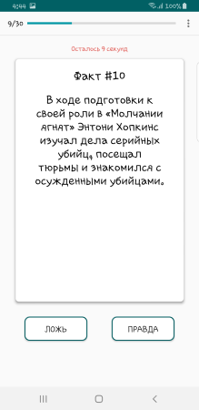
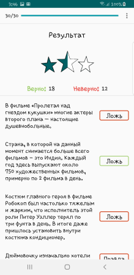
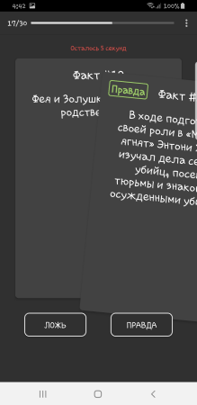

# True False

Game True or False.

A random question from the database is given, the user must answer whether this fact is true or not for a certain amount of time. Otherwise, he will lose.

# Screenshots

                          